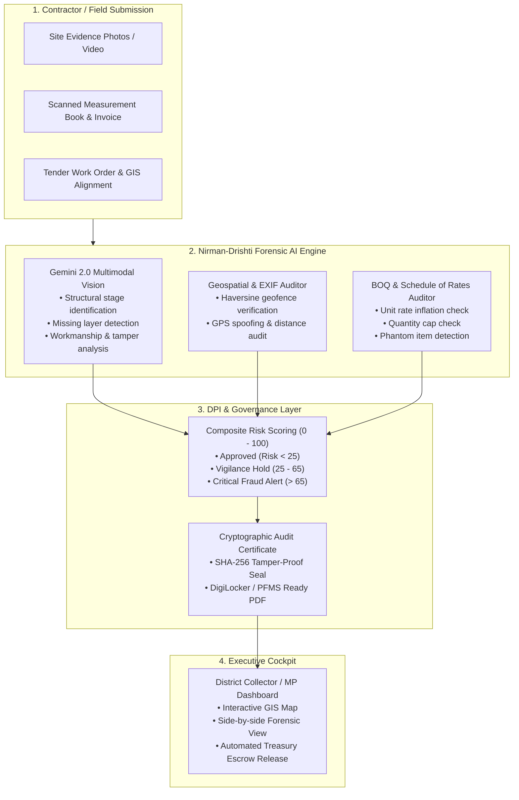

# 🏛️ Nirman-Drishti (निर्माण-दृष्टि)
### *Autonomous Multimodal Forensic Audit Engine for Public Infrastructure & Constituency Works*
> **Built for:** *Build with AI: Code for Communities 2.0 (Google Cloud & Hack2Skill)*  
> **Track:** *AI for Digital Public Infrastructure & Governance*  
> **Repository:** [github.com/hrlpavan/nirman-drishti](https://github.com/hrlpavan/nirman-drishti)

---

## 🚨 The High-Stakes Governance Problem
India spends over **₹10 Lakh Crore ($120B+)** annually on public infrastructure projects—including rural connectivity (PMGSY), rural drinking water (Jal Jeevan Mission), and constituency development under Members of Parliament (MPLADS). 

However, public fund disbursement currently relies on manual physical inspections by Junior Engineers (JEs) and paper-based Measurement Books (MBs). This manual bottleneck suffers from:
1. **Recycled / Staged Completion Photos:** Contractors submit photos of older projects, adjacent roads, or staging areas to claim milestone payouts before work is completed.
2. **Ghost Roads & Geofence Violations:** Milestone funds are drawn for work executed outside the sanctioned site alignment or not executed at all.
3. **Bill of Quantities (BOQ) Rate Inflation:** Invoices billed at inflated unit rates compared to the mandatory State Schedule of Rates (SoR), plus unsanctioned "phantom" items.
4. **Lack of Executive Situational Awareness:** District Collectors, Vigilance Officers, and Members of Parliament (MPs) lack an automated, real-time forensic cockpit to audit claims before releasing public money.

---

## 💡 The Solution: Nirman-Drishti
**Nirman-Drishti** is an autonomous, multimodal forensic auditor designed as Digital Public Infrastructure (DPI) for Indian district administrations and the Public Financial Management System (PFMS).



---

## 🌟 Key Innovations & Google Tech Integration

| Capability | Technology Stack | Real-World Civic Impact |
| :--- | :--- | :--- |
| **Multimodal Structural Stage Audit** | **Google Gemini 2.0 Flash / Pro** | Identifies whether the visible physical stage (e.g. WBM gravel vs. asphalt wearing coat) matches the claimed completion percentage. |
| **Geofence & Site Alignment Audit** | **Google Maps API / Geo-Spatial Haversine** | Detects if site photos were taken outside the sanctioned tender boundary (e.g., catching contractor claims taken 11 km away). |
| **State Schedule of Rates (SoR) Audit** | **Gemini Structured Outputs & Rules Engine** | Compares billed rates line-by-line against sanctioned CPWD/State PWD schedules to halt unauthorized overcharging. |
| **Tamper-Evident DPI Integration** | **SHA-256 / PFMS Digital Seal** | Emits verifiable digital inspection certificates conforming to the Central Secretariat Manual of Office Procedure (CSMOP). |

---

## 🧪 Benchmark Test Cases

Nirman-Drishti comes pre-configured with realistic public works benchmark scenarios:

### 1. Case A: PMGSY Rural Road Fraud (`CLM-2026-001`) — **🚨 REJECTED (Risk: 100/100)**
* **Claim:** Contractor claimed 100% completion of a 1.8 km bituminous road (₹48.0 Lakhs).
* **AI Findings:**
  * **Geofence Violation:** Evidence photo taken 11.5 km away from the sanctioned alignment (`GEO_TAMPERING`).
  * **Vision Mismatch:** Photo reveals only raw compacted gravel (WBM); bituminous concrete wear layer is absent.
  * **Rate Inflation:** Billed Bituminous Concrete at ₹88,000/MT vs. approved SoR rate of ₹65,000/MT.
  * **Quantity Overclaim:** Billed 110 MT vs. 75 MT sanctioned ceiling.
  * **Phantom Item:** Injected unsanctioned "roadside beautification" charge of ₹2.25 Lakhs.
* **Result:** Claim blocked; saved **₹48,00,000** for the public exchequer.

### 2. Case B: Jal Jeevan Mission Solar Pump (`CLM-2026-002`) — **✅ APPROVED (Risk: 0/100)**
* **Claim:** Final commissioning of 5HP solar submersible pump and elevated tank at PHC Shirwal (₹14.5 Lakhs).
* **AI Findings:** Coordinates match within 28 meters, visual components (solar array, pump, storage tank) verified operational, and rates match SoR exactly.
* **Result:** Approved for automated treasury disbursement.

### 3. Case C: MPLADS Community Center Najafgarh (`CLM-2026-003`) — **⚠️ FLAGGED FOR VIGILANCE (Risk: 15/100)**
* **Claim:** 50% milestone payment for concrete frame casting (₹32.5 Lakhs).
* **AI Findings:** Frame verified on site, but contractor inflated RCC M25 rate from ₹6,400 to ₹8,200/cum.
* **Result:** Overcharge of ₹3.15 Lakhs withheld; referred for Executive Engineer verification.

---

## 🚀 Quickstart & Installation

### 1. Clone & Set Up Environment
```bash
git clone https://github.com/hrlpavan/nirman-drishti.git
cd nirman-drishti

# Create virtual environment
python3 -m venv .venv
source .venv/bin/activate

# Install dependencies
pip install -r requirements.txt
```

### 2. Configure Environment (Optional for Live Gemini API)
```bash
cp .env.example .env
# Add your GEMINI_API_KEY in .env
```
*(Note: Nirman-Drishti includes high-fidelity forensic fallbacks so all self-checks and live demonstrations work seamlessly even without an external API key).*

### 3. Run Forensic Self-Check (Assert Suite)
```bash
python3 test_audit.py
```

### 4. Launch Executive Cockpit Dashboard
```bash
streamlit run app.py
```
Open your browser at `http://localhost:8501`.

---

## 🏛️ Project Directory Structure
```
nirman-drishti/
├── app.py                  # Streamlit Administrative Cockpit for District Collector & MP
├── test_audit.py           # Runnable assert-based test suite (Ponytail verification)
├── requirements.txt        # Production dependencies
├── .env.example            # Environment configuration template
├── core/
│   ├── models.py           # Pydantic models for Tenders, Claims, and Forensic Results
│   ├── vision_auditor.py   # Multimodal Gemini 2.0 & EXIF geospatial auditor
│   ├── boq_auditor.py      # Schedule of Rates (SoR) and BOQ financial validator
│   ├── audit_engine.py     # Master forensic orchestrator and composite risk scorer
│   └── cert_generator.py   # Official Government PDF audit certificate generator
├── data/
│   ├── tenders.json        # Benchmark public works tenders (PMGSY, JJM, MPLADS)
│   ├── claims.json         # Benchmark claims (genuine & fraudulent test cases)
│   ├── generate_samples.py # Script generating sample site evidence photos
│   └── sample_images/      # Synthetic evidence photos with EXIF metadata
```

---

## 🏆 Alignment with "Code for Communities 2.0"
* **Constituency Development:** Directly empowers MPs and District Magistrates with visibility into public spending.
* **Digital Public Infrastructure (DPI):** Plugs into PFMS and DigiLocker via cryptographic audit seals.
* **High ROI / Zero Fluff:** Stops corruption before disbursement rather than investigating it years later.
